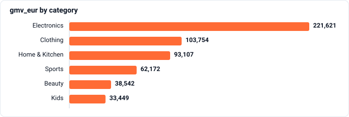
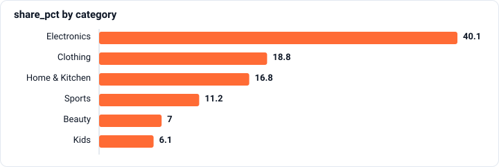

# Windows and the final report

`SQL` · `DuckDB` · `Course final project` · `Fictional marketplace data`

[← All projects](../../README.md)

## Context

Vera needs a category report for the board by Friday evening, with orders, sales, average order value and sales shares. She also wants the leading shop in each category.

## Why it’s not obvious

A category breakdown can look plausible while omitting orders or counting them twice. Its order counts and sales shares need an independent total check.

_Scenario context supplied by Atterna._



## Business question

> Friday. I need a final report for the board: for each category — orders, GMV, average order value and share of total GMV. And separately — the best shop in each category. By this evening.

## Approach

8 SQL queries, each checked automatically.

### Step 1

**Task.** For each category: GMV of paid orders and its share of total GMV in per cent, rounded to one decimal place.

_Completed from a template the task gave me._

```sql
SELECT s.category,
       SUM(o.items_total_eur) AS gmv_eur,
       ROUND(100.0 * SUM(o.items_total_eur) / SUM(SUM(o.items_total_eur)) OVER (), 1) AS share_pct
FROM meridian.orders  AS o
JOIN meridian.sellers AS s ON s.seller_id = o.seller_id
WHERE o.status = 'paid'
GROUP BY s.category
ORDER BY gmv_eur DESC
```

**Result** (6 rows) · [CSV](results/01-share-task.csv)

| category | gmv_eur | share_pct |
| :--- | ---: | ---: |
| Electronics | 221621.33 | 40.1 |
| Clothing | 103754.48 | 18.8 |
| Home & Kitchen | 93107.05 | 16.8 |
| Sports | 62171.61 | 11.2 |
| Beauty | 38542.38 | 7 |
| Kids | 33448.51 | 6.1 |



### Step 2

**Task.** Every shop with its place by GMV within its category, 1 being the biggest. Step g with the GMV figures is ready: add the window ROW_NUMBER() OVER (PARTITION BY … ORDER BY …).

_Completed from a template the task gave me._

```sql
SELECT s.category,
       s.seller_name,
       SUM(o.items_total_eur) AS gmv_eur,
       ROW_NUMBER() OVER (PARTITION BY s.category ORDER BY SUM(o.items_total_eur) DESC) AS place
FROM meridian.orders  AS o
JOIN meridian.sellers AS s ON s.seller_id = o.seller_id
WHERE o.status = 'paid'
GROUP BY s.category, s.seller_name
ORDER BY s.category, place
```

**Result** (first 10 of 36 rows) · [CSV](results/02-rank-task.csv)

| category | seller_name | gmv_eur | place |
| :--- | :--- | ---: | ---: |
| Beauty | Velvet | 7281.14 | 1 |
| Beauty | Alpine Herbs | 6601.11 | 2 |
| Beauty | Linden Soapworks | 6574.98 | 3 |
| Beauty | Aroma Shop | 6322.76 | 4 |
| Beauty | Clear Skin | 6098.46 | 5 |
| Beauty | Dew | 5663.93 | 6 |
| Clothing | Linen Shop | 18098.53 | 1 |
| Clothing | Tweed | 18061.34 | 2 |
| Clothing | Urban Form | 17809.99 | 3 |
| Clothing | Basic Wardrobe | 17081.58 | 4 |

### Step 3

**Task.** For each category, the one shop with the highest GMV from paid orders, and that GMV.

_Completed from a template the task gave me._

```sql
WITH shop_gmv AS (
    SELECT s.category, s.seller_name, SUM(o.items_total_eur) AS gmv_eur
    FROM meridian.orders  AS o
    JOIN meridian.sellers AS s ON s.seller_id = o.seller_id
    WHERE o.status = 'paid'
    GROUP BY s.category, s.seller_name
)
SELECT category, seller_name, gmv_eur
FROM (
    SELECT *, ROW_NUMBER() OVER (PARTITION BY category ORDER BY gmv_eur DESC) AS place
    FROM shop_gmv
) AS ranked
WHERE place = 1
ORDER BY gmv_eur DESC
```

**Result** (6 rows) · [CSV](results/03-best-shop.csv)

| category | seller_name | gmv_eur |
| :--- | :--- | ---: |
| Electronics | Contact Electro | 43063.25 |
| Clothing | Linen Shop | 18098.53 |
| Home & Kitchen | Homestead | 16615.95 |
| Sports | Racket | 11638.13 |
| Beauty | Velvet | 7281.14 |
| Kids | Growing Together | 6442.31 |

### Step 4

**Task.** For each day: GMV of the day's paid orders and the running total from the first day. Sorted by day.

_Completed from a template the task gave me._

```sql
SELECT date_trunc('day', created_at)                                         AS day,
       SUM(items_total_eur)                                                  AS gmv_eur,
       SUM(SUM(items_total_eur)) OVER (ORDER BY date_trunc('day', created_at)) AS running_gmv_eur
FROM meridian.orders
WHERE status = 'paid'
GROUP BY date_trunc('day', created_at)
ORDER BY day
```

**Result** (first 10 of 23 rows) · [CSV](results/04-running-task.csv)

| day | gmv_eur | running_gmv_eur |
| :--- | ---: | ---: |
| 2026-08-31 | 23284.06 | 23284.06 |
| 2026-09-01 | 18274.89 | 41558.95 |
| 2026-09-02 | 22968.55 | 64527.5 |
| 2026-09-03 | 22504.96 | 87032.46 |
| 2026-09-04 | 21106.97 | 108139.43 |
| 2026-09-05 | 25943.49 | 134082.92 |
| 2026-09-06 | 15728.93 | 149811.85 |
| 2026-09-07 | 22552.68 | 172364.53 |
| 2026-09-08 | 20702.74 | 193067.27 |
| 2026-09-09 | 22930.29 | 215997.56 |

### Step 5

**Task.** For each catalogue category, the three products with the most units ordered (all orders, cancelled ones too — we're measuring demand). Only products that are in stock and were added before 1 September 2026.

```sql
WITH demand AS (
    SELECT c.category, i.product_title, SUM(i.qty) AS units
    FROM meridian.order_items AS i
    JOIN meridian.catalog     AS c ON c.title = i.product_title
    WHERE c.in_stock AND c.added_at < DATE '2026-09-01'      -- new products have not had time to sell
    GROUP BY c.category, i.product_title
),
ranked AS (
    SELECT *, ROW_NUMBER() OVER (PARTITION BY category ORDER BY units DESC) AS place
    FROM demand
)
SELECT category, product_title, units
FROM ranked
WHERE place <= 3
ORDER BY category, units DESC, product_title
```

**Result** (first 10 of 18 rows) · [CSV](results/05-gym-top3.csv)

| category | product_title | units |
| :--- | :--- | ---: |
| Beauty | Handmade soap | 576 |
| Beauty | Face serum | 570 |
| Beauty | Hand cream | 532 |
| Clothing | Wool socks | 821 |
| Clothing | Basic T-shirt | 819 |
| Clothing | Linen scarf | 799 |
| Electronics | Webcam | 832 |
| Electronics | Fitness band | 813 |
| Electronics | Wireless headphones | 810 |
| Home & Kitchen | Desk lamp | 844 |

### Step 6

**Task.** For each city: how many people registered, and how many of them made at least one paid order. Write it from an empty editor.

```sql
SELECT b.city,
       COUNT(*)                   AS registered,
       COUNT(DISTINCT p.buyer_id) AS paying
FROM meridian.buyers AS b
LEFT JOIN (
    SELECT DISTINCT buyer_id
    FROM meridian.orders
    WHERE status = 'paid'
) AS p ON p.buyer_id = b.buyer_id
GROUP BY b.city
ORDER BY registered DESC, b.city
```

**Result** (8 rows) · [CSV](results/06-cold-cities.csv)

| city | registered | paying |
| :--- | ---: | ---: |
| Riga | 928 | 502 |
| Vilnius | 878 | 454 |
| Berlin | 874 | 472 |
| Lisbon | 874 | 425 |
| Warsaw | 873 | 462 |
| Helsinki | 869 | 462 |
| Amsterdam | 857 | 438 |
| Tallinn | 847 | 437 |

### Step 7

**Task.** For each category: paid orders, GMV, average order value to the cent and share of GMV in per cent to one decimal place. Sorted by GMV, from largest to smallest.

```sql
SELECT s.category,
       COUNT(*)                         AS orders,
       SUM(o.items_total_eur)           AS gmv_eur,
       ROUND(AVG(o.items_total_eur), 2) AS aov_eur,
       ROUND(100.0 * SUM(o.items_total_eur) / SUM(SUM(o.items_total_eur)) OVER (), 1) AS share_pct
FROM meridian.orders  AS o
JOIN meridian.sellers AS s ON s.seller_id = o.seller_id
WHERE o.status = 'paid'
GROUP BY s.category
ORDER BY gmv_eur DESC
```

**Result** (6 rows) · [CSV](results/07-report.csv)

| category | orders | gmv_eur | aov_eur | share_pct |
| :--- | ---: | ---: | ---: | ---: |
| Electronics | 2062 | 221621.33 | 107.48 | 40.1 |
| Clothing | 1772 | 103754.48 | 58.55 | 18.8 |
| Home & Kitchen | 2072 | 93107.05 | 44.94 | 16.8 |
| Sports | 1015 | 62171.61 | 61.25 | 11.2 |
| Beauty | 1288 | 38542.38 | 29.92 | 7 |
| Kids | 862 | 33448.51 | 38.8 | 6.1 |


### Step 8

**Task.** One row: the report's orders added up across categories, all paid orders counted straight from orders, and the report's shares added up, to one decimal place. Steps c and r are ready: that's the report itself.

_Completed from a template the task gave me._

```sql
WITH by_category AS (
    SELECT s.category, COUNT(*) AS orders, SUM(o.items_total_eur) AS gmv_eur
    FROM meridian.orders  AS o
    JOIN meridian.sellers AS s ON s.seller_id = o.seller_id
    WHERE o.status = 'paid'
    GROUP BY s.category
),
shares AS (
    SELECT orders, ROUND(100.0 * gmv_eur / SUM(gmv_eur) OVER (), 1) AS share_pct
    FROM by_category
)
SELECT SUM(orders)                                                    AS orders_in_report,
       (SELECT COUNT(*) FROM meridian.orders WHERE status = 'paid')   AS paid_orders,
       ROUND(SUM(share_pct), 1)                                       AS shares_sum
FROM shares
```

**Result** (1 row) · [CSV](results/08-report-check.csv)

| orders_in_report | paid_orders | shares_sum |
| ---: | ---: | ---: |
| 9071 | 9071 | 100 |

## What I’d check next

Repeat the report for a new period and check its category totals against all paid orders.

_Suggested by the exercise; review and adapt before publishing._

## How it was checked

- 8 SQL queries were checked automatically against a hidden reference, on two versions of the data.
- 7 of 8 passed on the first try.
- 9 attempts in total.
- Result tables for course and case steps were re-run on the practice dataset when this repository was built; episode results are the rows stored when the query was accepted.
- Completed 3 October 2026.

---

<sub>Sample generated by Atterna from synthetic progress on fictional Meridian data. Task and data: Atterna. SQL and decisions: the sample learner’s.</sub>
