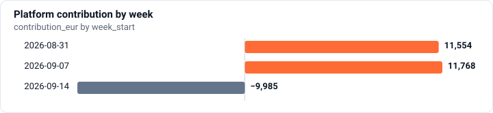
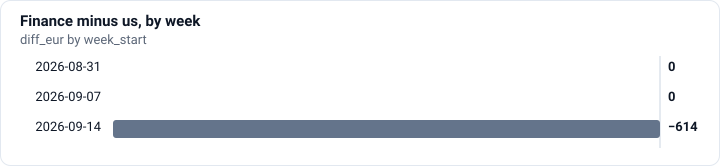

# Record week

`SQL` · `DuckDB` · `Meridian episode 1` · `Fictional marketplace data`

[← All projects](../../README.md)

## Context

Vera needs a recommendation for Thursday's decision on extending the promotion. The dashboard shows record sales, but the team will commit its budget on the analyst's numbers.

## Why it’s not obvious

A join can repeat an order's value on each item and inflate the sales total. Even a genuine sales increase does not show what the platform earned after discounts and advertising.

_Scenario context supplied by Atterna._

> **Finding:** GMV rose in the promo week, but contribution was negative: discounts and ads cost more than all the commission the week earned.
>
> **Key numbers:** **−€9,984.50** Platform contribution in the promo week · **79.50%** Share of discounts that went to returning customers
>
> **My call:** Stop the promo and run a test: a discount for half of the new customers, none for the other half, and compare repeat purchases after three weeks



## Business question

> The dashboard shows record GMV. The promo decision is on Thursday. What really happened to the money?

**What I set out to find out:**

> Should we extend the AUTUMN20 promo through October with a doubled budget, given that the dashboard shows record GMV?

_My own words._

## Definition

> GMV = items_total_eur of paid orders, by calendar week of created_at (Tallinn time for finance). Contribution = net commission - platform discounts - card fees - marketing, per finance's rules.

_My own words._

## Approach

6 SQL queries, each checked automatically.

### 1. GMV by week

**Task.** One row per week from the weeks table, with the number of paid orders and GMV.

```sql
SELECT w.week_start,
       COUNT(*)               AS orders,
       SUM(o.items_total_eur) AS gmv_eur
FROM meridian.orders AS o
JOIN meridian.weeks  AS w ON o.created_at >= w.week_start AND o.created_at < w.week_end
WHERE o.status = 'paid'
GROUP BY w.week_start
ORDER BY w.week_start
```

**Result** (3 rows) · [CSV](results/01-gmv-by-week.csv)

| week_start | orders | gmv_eur |
| :--- | ---: | ---: |
| 2026-08-31 | 2625 | 149811.85 |
| 2026-09-07 | 2751 | 150502.86 |
| 2026-09-14 | 3289 | 230967.18 |

### 2. Where the record came from

**Task.** For each of the three weeks: GMV the way the dashboard query calculates it, the correct GMV, and the average number of line items in a paid order.

```sql
WITH line_counts AS (
    SELECT order_id, COUNT(*) AS n_lines
    FROM meridian.order_items
    GROUP BY order_id
),
paid AS (
    SELECT o.created_at, o.items_total_eur, lc.n_lines
    FROM meridian.orders AS o
    JOIN line_counts     AS lc ON lc.order_id = o.order_id
    WHERE o.status = 'paid'
)
SELECT w.week_start,
       SUM(p.items_total_eur * p.n_lines) AS dashboard_gmv_eur,  -- the dashboard joins order_items: an order counts once per line
       SUM(p.items_total_eur)             AS gmv_eur,
       AVG(p.n_lines)                     AS avg_lines
FROM meridian.weeks AS w
JOIN paid AS p ON p.created_at >= w.week_start AND p.created_at < w.week_end
GROUP BY w.week_start
ORDER BY w.week_start
```

**Result** (3 rows) · [CSV](results/02-where-the-record-came-from.csv)

| week_start | dashboard_gmv_eur | gmv_eur | avg_lines |
| :--- | ---: | ---: | ---: |
| 2026-08-31 | 323431.26 | 149811.85 | 1.7131 |
| 2026-09-07 | 313943.18 | 150502.86 | 1.6779 |
| 2026-09-14 | 557752.08 | 230967.18 | 1.9465 |

### 3. Reconciling with finance

**Task.** Calculate weekly GMV, commission and take rate. Compare the totals with Olga's attachment and explain any difference.

```sql
SELECT w.week_start,
       SUM(o.items_total_eur)                                                          AS gmv_eur,
       SUM(o.items_total_eur * s.commission_rate)                                      AS commission_eur,
       100.0 * SUM(o.items_total_eur * s.commission_rate) / SUM(o.items_total_eur)     AS take_rate_pct
FROM meridian.orders  AS o
JOIN meridian.sellers AS s ON s.seller_id = o.seller_id
JOIN meridian.weeks   AS w ON o.created_at >= w.week_start AND o.created_at < w.week_end
WHERE o.status = 'paid'
GROUP BY w.week_start
ORDER BY w.week_start
```

**Result** (3 rows) · [CSV](results/03-reconciling-with-finance.csv)

| week_start | gmv_eur | commission_eur | take_rate_pct |
| :--- | ---: | ---: | ---: |
| 2026-08-31 | 149811.85 | 18830.3864 | 12.5694 |
| 2026-09-07 | 150502.86 | 18970.5755 | 12.6048 |
| 2026-09-14 | 230967.18 | 26477.5428 | 11.4638 |

### 4. Where the difference with finance comes from

**Task.** For each week in the weeks table: our GMV of paid orders, GMV the way the finance system calculates it, and the difference “finance minus us”.

```sql
WITH paid AS (
    SELECT items_total_eur,
           created_at,
           created_at + INTERVAL 3 HOUR AS created_tallinn   -- finance books on Tallinn time, UTC+3 in September
    FROM meridian.orders
    WHERE status = 'paid'
)
SELECT w.week_start,
       SUM(p.items_total_eur) FILTER (WHERE p.created_at      >= w.week_start AND p.created_at      < w.week_end) AS gmv_eur,
       SUM(p.items_total_eur) FILTER (WHERE p.created_tallinn >= w.week_start AND p.created_tallinn < w.week_end) AS finance_gmv_eur,
       SUM(p.items_total_eur) FILTER (WHERE p.created_tallinn >= w.week_start AND p.created_tallinn < w.week_end)
     - SUM(p.items_total_eur) FILTER (WHERE p.created_at      >= w.week_start AND p.created_at      < w.week_end) AS diff_eur
FROM meridian.weeks AS w
CROSS JOIN paid AS p
GROUP BY w.week_start
ORDER BY w.week_start
```

**Result** (3 rows) · [CSV](results/04-where-the-difference-with-finance.csv)

| week_start | gmv_eur | finance_gmv_eur | diff_eur |
| :--- | ---: | ---: | ---: |
| 2026-08-31 | 149811.85 | 149811.85 | 0 |
| 2026-09-07 | 150502.86 | 150502.86 | 0 |
| 2026-09-14 | 230967.18 | 230352.74 | -614.44 |



### 5. What the platform really earned

**Task.** By week: the parts of platform contribution and the total, following Olga's rules in the attachment.

```sql
WITH paid_orders AS (
    SELECT w.week_id, w.week_start, o.order_id, o.items_total_eur, o.platform_discount_eur, o.paid_eur, s.commission_rate
    FROM meridian.orders  AS o
    JOIN meridian.sellers AS s ON s.seller_id = o.seller_id
    JOIN meridian.weeks   AS w ON o.created_at >= w.week_start AND o.created_at < w.week_end
    WHERE o.status = 'paid'
),
completed_refunds AS (            -- pending refunds have not left the bank yet: they do not count
    SELECT order_id, SUM(amount_eur) AS refunded_eur
    FROM meridian.refunds
    WHERE status = 'completed'
    GROUP BY order_id
),
weekly AS (
    SELECT p.week_id,
           p.week_start,
           SUM(p.items_total_eur)                                                    AS gmv_eur,
           SUM(p.items_total_eur * p.commission_rate)
             - SUM(COALESCE(cr.refunded_eur, 0) * p.commission_rate)                 AS commission_net_eur,
           SUM(p.platform_discount_eur)                                              AS platform_discount_eur,
           SUM(p.paid_eur) * 0.018                                                   AS card_fees_eur
    FROM paid_orders AS p
    LEFT JOIN completed_refunds AS cr ON cr.order_id = p.order_id
    GROUP BY p.week_id, p.week_start
),
marketing AS (
    SELECT week_id, SUM(spend_eur) AS marketing_eur
    FROM meridian.marketing_spend
    GROUP BY week_id
)
SELECT k.week_start,
       k.gmv_eur,
       k.commission_net_eur,
       k.platform_discount_eur,
       k.card_fees_eur,
       m.marketing_eur,
       k.commission_net_eur - k.platform_discount_eur - k.card_fees_eur - m.marketing_eur AS contribution_eur
FROM weekly AS k
JOIN marketing AS m ON m.week_id = k.week_id
ORDER BY k.week_start
```

**Result** (3 rows) · [CSV](results/05-what-the-platform-really-earned.csv)

| week_start | gmv_eur | commission_net_eur | platform_discount_eur | card_fees_eur | marketing_eur | contribution_eur |
| :--- | ---: | ---: | ---: | ---: | ---: | ---: |
| 2026-08-31 | 149811.85 | 18437.2732 | 1005 | 2678.5233 | 3200 | 11553.7499 |
| 2026-09-07 | 150502.86 | 18578.6814 | 765 | 2695.2815 | 3350 | 11768.3999 |
| 2026-09-14 | 230967.18 | 26001.7851 | 21516.17 | 3770.1182 | 10700 | -9984.5031 |


### 6. Who came for the discount

**Task.** Split the promo week's paid orders into orders from new and returning customers: how many orders and how much platform discount went to each group.

```sql
WITH promo_week AS (
    SELECT o.buyer_id, o.platform_discount_eur
    FROM meridian.orders AS o
    JOIN meridian.weeks  AS w ON o.created_at >= w.week_start AND o.created_at < w.week_end
    WHERE w.is_promo AND o.status = 'paid'
),
paid_before AS (
    SELECT DISTINCT buyer_id
    FROM meridian.orders
    WHERE status = 'paid' AND created_at < TIMESTAMP '2026-09-14'
)
SELECT CASE WHEN b.buyer_id IS NULL THEN 'new' ELSE 'returning' END AS buyer_type,
       COUNT(*)                     AS orders,
       SUM(p.platform_discount_eur) AS discount_eur
FROM promo_week AS p
LEFT JOIN paid_before AS b ON b.buyer_id = p.buyer_id
GROUP BY buyer_type
ORDER BY orders DESC
```

**Result** (2 rows) · [CSV](results/06-who-came-for-the-discount.csv)

| buyer_type | orders | discount_eur |
| :--- | ---: | ---: |
| returning | 2618 | 17112.92 |
| new | 671 | 4403.25 |

## Numbers I reported

_Typed by me; the checker accepted each one within its tolerance._

| Number | My value |
| :--- | ---: |
| Platform contribution in the promo week | −€9,984.50 |
| Share of discounts that went to returning customers | 79.50% |

## Decision and recommendation

**Option I chose:** Stop the promo and run a test: a discount for half of the new customers, none for the other half, and compare repeat purchases after three weeks (Luka's proposal)

_Selected from the options the exercise offered._

**What I claimed from the numbers:** GMV rose in the promo week, but contribution was negative: discounts and ads cost more than all the commission the week earned.

**My recommendation, in my own words:**

> Do not extend on the current terms. Run the promo as a test instead: half of the new customers get the discount, half do not, and we compare contribution after three weeks. The promo week lost about 10k euros of contribution while GMV was a record.

_My own words._

## Limits and what I’d check next

**What the data do not show:**

> A before/after comparison on one promo week cannot show that the promo caused the extra GMV, and the week also had a dashboard double-count that I corrected, so I am less sure about the older weeks.

**What would change it:**

> A comparable test where the discounted group shows positive contribution per new customer after three weeks.

_My own words._

## How it was checked

- 6 SQL queries were checked automatically against a hidden reference, on two versions of the data.
- 5 of 6 passed on the first try.
- Hints used on 1 query.
- 7 attempts in total.
- Data version: 2026-09-26.en1.
- Completed 3 October 2026.

---

<sub>Sample generated by Atterna from synthetic progress on fictional Meridian data. Task and data: Atterna. SQL and decisions: the sample learner’s.</sub>
