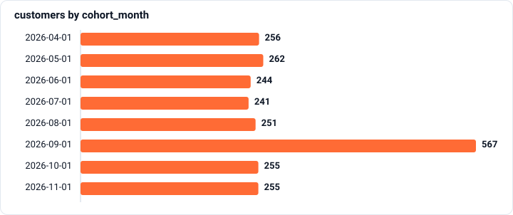

# Who stays after the first purchase

`SQL` · `DuckDB` · `Meridian episode 3` · `Fictional marketplace data`

[← All projects](../../README.md)

## Context

Vera must explain the retention drop to the CEO while marketing proposes repeating AUTUMN20 for the December sale. Thursday's plan depends on whether the promotion brought customers who return.

## Why it’s not obvious

The latest cohort may not have had a full return window. Mixing promotion and regular customers, or counting another discounted order as a full-price return, can also change the story.

_Scenario context supplied by Atterna._

> **Finding:** Retention fell because of the cohort's mix: regulars hold up as before, while promotion customers rarely come back at full price and lost the platform money over 60 days.
>
> **Key numbers:** **7.20%** Month-1 retention of promotion customers · **−€1.70** Commission net of discounts per promotion customer over 60 days
>
> **My call:** A discount only on a new customer's first order over €40, with 20% of newcomers getting no discount so we can compare platform contribution after 60 days



## Business question

> The retention dashboard shows a collapse. Marketing wants to repeat the autumn promotion for the December sale. The decision is on Thursday.

## Approach

5 SQL queries, each checked automatically.

### 1. How many new customers arrive each month

**Task.** By month, April to November: how many customers made their first paid purchase that month.

```sql
WITH first_purchase AS (
    SELECT customer_id, MIN(created_at) AS first_at
    FROM meridian.order_history
    WHERE status = 'paid'
    GROUP BY customer_id
)
SELECT date_trunc('month', first_at) AS cohort_month,
       COUNT(*)                      AS customers
FROM first_purchase
WHERE first_at >= TIMESTAMP '2026-04-01' AND first_at < TIMESTAMP '2026-12-01'
GROUP BY cohort_month
ORDER BY cohort_month
```

**Result** (8 rows) · [CSV](results/01-how-many-new-customers-arrive-each.csv)

| cohort_month | customers |
| :--- | ---: |
| 2026-04-01 | 256 |
| 2026-05-01 | 262 |
| 2026-06-01 | 244 |
| 2026-07-01 | 241 |
| 2026-08-01 | 251 |
| 2026-09-01 | 567 |
| 2026-10-01 | 255 |
| 2026-11-01 | 255 |


### 2. Retention by cohort

**Task.** For the cohorts from April onwards (today is 1 December): how many customers are in the cohort, how many of them paid for another order in the next calendar month, and what percentage that is. The report includes only the cohorts whose retention can already be calculated fairly.

```sql
WITH first_purchase AS (
    SELECT customer_id, MIN(created_at) AS first_at
    FROM meridian.order_history
    WHERE status = 'paid'
    GROUP BY customer_id
),
returned_next_month AS (
    SELECT DISTINCT f.customer_id
    FROM first_purchase AS f
    JOIN meridian.order_history AS o
      ON o.customer_id = f.customer_id
     AND o.status = 'paid'
     AND date_trunc('month', o.created_at) = date_trunc('month', f.first_at) + INTERVAL 1 MONTH
)
SELECT date_trunc('month', f.first_at)                AS cohort_month,
       COUNT(*)                                       AS customers,
       COUNT(r.customer_id)                           AS retained_m1,
       100.0 * COUNT(r.customer_id) / COUNT(*)        AS retention_m1_pct
FROM first_purchase AS f
LEFT JOIN returned_next_month AS r ON r.customer_id = f.customer_id
WHERE f.first_at >= TIMESTAMP '2026-04-01'
  AND f.first_at <  TIMESTAMP '2026-11-01'      -- today is 1 December: November's next month has barely started
GROUP BY cohort_month
ORDER BY cohort_month
```

**Result** (7 rows) · [CSV](results/02-retention-by-cohort.csv)

| cohort_month | customers | retained_m1 | retention_m1_pct |
| :--- | ---: | ---: | ---: |
| 2026-04-01 | 256 | 76 | 29.6875 |
| 2026-05-01 | 262 | 63 | 24.0458 |
| 2026-06-01 | 244 | 69 | 28.2787 |
| 2026-07-01 | 241 | 61 | 25.3112 |
| 2026-08-01 | 251 | 69 | 27.49 |
| 2026-09-01 | 567 | 87 | 15.3439 |
| 2026-10-01 | 255 | 59 | 23.1373 |

### 3. Who really didn't come back

**Task.** For the April–October cohorts, split customers into those whose first paid purchase had the AUTUMN20 code ('promo') and everyone else ('regular'). For each cohort–type pair: how many customers and the month-1 retention.

```sql
WITH
paid AS (
    SELECT customer_id, created_at, promo_code,
           ROW_NUMBER() OVER (PARTITION BY customer_id ORDER BY created_at) AS order_no
    FROM meridian.order_history
    WHERE status = 'paid'
),
first_order AS (
    SELECT customer_id,
           created_at AS first_at,
           CASE WHEN promo_code = 'AUTUMN20' THEN 'promo' ELSE 'regular' END AS first_type
    FROM paid
    WHERE order_no = 1
),
came_back AS (
    SELECT DISTINCT f.customer_id
    FROM first_order AS f
    JOIN meridian.order_history AS o
      ON o.customer_id = f.customer_id
     AND o.status = 'paid'
     AND date_trunc('month', o.created_at) = date_trunc('month', f.first_at) + INTERVAL 1 MONTH
)
SELECT date_trunc('month', f.first_at)         AS cohort_month,
       f.first_type,
       COUNT(*)                                AS customers,
       100.0 * COUNT(c.customer_id) / COUNT(*) AS retention_m1_pct
FROM first_order AS f
LEFT JOIN came_back AS c ON c.customer_id = f.customer_id
WHERE f.first_at >= TIMESTAMP '2026-04-01' AND f.first_at < TIMESTAMP '2026-11-01'
GROUP BY cohort_month, f.first_type
ORDER BY cohort_month, f.first_type
```

**Result** (8 rows) · [CSV](results/03-who-really-didnt-come-back.csv)

| cohort_month | first_type | customers | retention_m1_pct |
| :--- | :--- | ---: | ---: |
| 2026-04-01 | regular | 256 | 29.6875 |
| 2026-05-01 | regular | 262 | 24.0458 |
| 2026-06-01 | regular | 244 | 28.2787 |
| 2026-07-01 | regular | 241 | 25.3112 |
| 2026-08-01 | regular | 251 | 27.49 |
| 2026-09-01 | promo | 334 | 7.1856 |
| 2026-09-01 | regular | 233 | 27.0386 |
| 2026-10-01 | regular | 255 | 23.1373 |

### 4. Came back, or stocked up?

**Task.** For the September cohort, by type of first purchase: how many customers, what share paid for at least one more order within 60 days of the first (as in Tomás's report), and what share placed another order without a promo code in those same 60 days (the first order doesn’t count).

```sql
WITH
paid AS (
    SELECT customer_id, created_at, promo_code,
           ROW_NUMBER() OVER (PARTITION BY customer_id ORDER BY created_at) AS order_no
    FROM meridian.order_history
    WHERE status = 'paid'
),
first_order AS (
    SELECT customer_id,
           created_at AS first_at,
           CASE WHEN promo_code = 'AUTUMN20' THEN 'promo' ELSE 'regular' END AS first_type
    FROM paid
    WHERE order_no = 1
),
within_60_days AS (
    SELECT f.customer_id,
           COUNT(*)                                       AS later_orders,
           COUNT(*) FILTER (WHERE o.promo_code IS NULL)   AS later_full_price_orders
    FROM first_order AS f
    JOIN meridian.order_history AS o
      ON o.customer_id = f.customer_id
     AND o.status = 'paid'
     AND o.created_at >  f.first_at
     AND o.created_at <  f.first_at + INTERVAL 60 DAY
    GROUP BY f.customer_id
)
SELECT f.first_type,
       COUNT(*)                                                           AS customers,
       100.0 * COUNT(w.customer_id) / COUNT(*)                            AS repeat_pct,
       100.0 * COUNT(*) FILTER (WHERE w.later_full_price_orders > 0) / COUNT(*) AS full_price_pct
FROM first_order AS f
LEFT JOIN within_60_days AS w ON w.customer_id = f.customer_id
WHERE f.first_at >= TIMESTAMP '2026-09-01' AND f.first_at < TIMESTAMP '2026-10-01'
GROUP BY f.first_type
ORDER BY f.first_type
```

**Result** (2 rows) · [CSV](results/04-came-back-or-stocked-up.csv)

| first_type | customers | repeat_pct | full_price_pct |
| :--- | ---: | ---: | ---: |
| promo | 334 | 44.6108 | 11.3772 |
| regular | 233 | 42.9185 | 42.4893 |

### 5. How much the platform earned on them

**Task.** For the September cohort, by type of first purchase: how many customers, and GMV and platform contribution per customer over the first 60 days, including the first purchase. An order's contribution is commission_eur minus platform_discount_eur.

```sql
WITH
paid AS (
    SELECT customer_id, created_at, promo_code,
           ROW_NUMBER() OVER (PARTITION BY customer_id ORDER BY created_at) AS order_no
    FROM meridian.order_history
    WHERE status = 'paid'
),
first_order AS (
    SELECT customer_id,
           created_at AS first_at,
           CASE WHEN promo_code = 'AUTUMN20' THEN 'promo' ELSE 'regular' END AS first_type
    FROM paid
    WHERE order_no = 1
),
first_60_days AS (
    SELECT f.customer_id,
           f.first_type,
           SUM(o.items_total_eur)                           AS gmv_eur,
           SUM(o.commission_eur - o.platform_discount_eur)  AS contribution_eur
    FROM first_order AS f
    JOIN meridian.order_history AS o
      ON o.customer_id = f.customer_id
     AND o.status = 'paid'
     AND o.created_at >= f.first_at
     AND o.created_at <  f.first_at + INTERVAL 60 DAY
    WHERE f.first_at >= TIMESTAMP '2026-09-01' AND f.first_at < TIMESTAMP '2026-10-01'
    GROUP BY f.customer_id, f.first_type
)
SELECT first_type,
       COUNT(*)              AS customers,
       AVG(gmv_eur)          AS gmv_per_customer_eur,
       AVG(contribution_eur) AS margin_per_customer_eur
FROM first_60_days
GROUP BY first_type
ORDER BY first_type
```

**Result** (2 rows) · [CSV](results/05-how-much-the-platform-earned-on.csv)

| first_type | customers | gmv_per_customer_eur | margin_per_customer_eur |
| :--- | ---: | ---: | ---: |
| promo | 334 | 86.3133 | -1.7272 |
| regular | 233 | 80.6342 | 10.3245 |

## Numbers I reported

_Typed by me; the checker accepted each one within its tolerance._

| Number | My value |
| :--- | ---: |
| Month-1 retention of promotion customers | 7.20% |
| Commission net of discounts per promotion customer over 60 days | −€1.70 |

## Decision and recommendation

**Option I chose:** A discount only on a new customer's first order over €40, with 20% of newcomers getting no discount so we can compare platform contribution after 60 days (Olga's proposal)

_Selected from the options the exercise offered._

**What I claimed from the numbers:** Retention fell because of the cohort's mix: regulars hold up as before, while promotion customers rarely come back at full price and lost the platform money over 60 days.

## What I’d check next

Follow mature cohorts for longer, separating discounted and full-price repeat orders and measuring platform contribution.

_Suggested by the exercise; review and adapt before publishing._

## How it was checked

- 5 SQL queries were checked automatically against a hidden reference, on two versions of the data.
- 4 of 5 passed on the first try.
- No hints used.
- 6 attempts in total.
- Data version: 2026-09-26.en1.
- Completed 3 October 2026.

---

<sub>Sample generated by Atterna from synthetic progress on fictional Meridian data. Task and data: Atterna. SQL and decisions: the sample learner’s.</sub>
